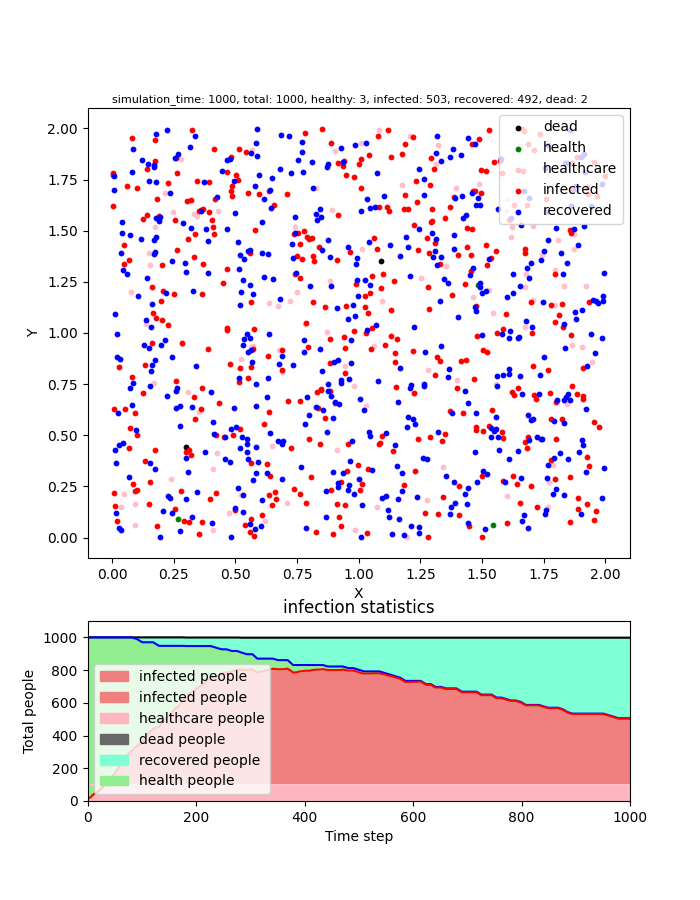
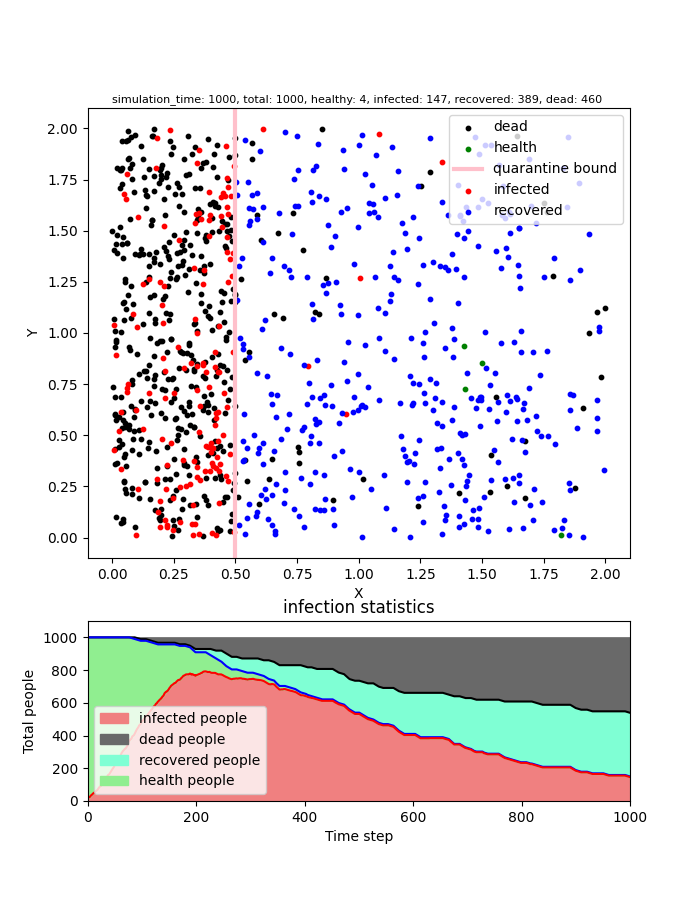
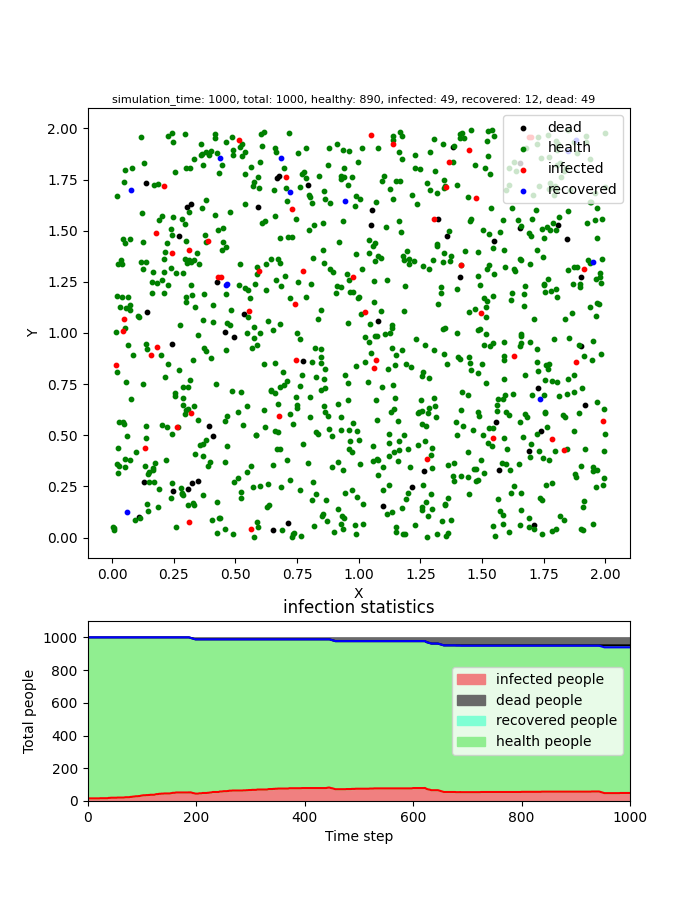

# NSD Term Project (f-21)
## A-simple-virus-spread-simulation
``` Author: Eric Zhong```

## Overview

A simple virus spread simulation, which can modify config.py to set the simulation configuration and run it.

This simulation use C++ computing power to speed up the calculation process in the simulation process and use python to visualize the simulation results.

This simulation combine C++ and python3 by pybind11.

## Problem to Solve
In recent years, COVID-19 has been raging around the world.
It has a great impact on everyone's lives.
According to [this article](https://www.washingtonpost.com/graphics/2020/world/corona-simulator/), the spread of COVID-19 is increasing exponentially.
In order to prevent the spread of COVID-19, each country/region has implemented many policies (e.g. quarantine, restriction of in-store dining, lockdown...).
These policies have produced different results in controlling the spread of COVID-19.


I want to simulate the impact of different policies on the spread of pandemic viruses.
User can adjust parameters(e.g. virus infection rate, virus mortality rate...) and policy to observe the final result.
I will use animation to show the process of infection and print the distribution of the virus spread.
Therefore, we can observe the difference in the distribution of infection under different policies.

## Prospective Users
Those who want to know if these policies help prevent the spread of COVID-19.
Users can set different conditions, such as the total number of people, virus infection rate, death rate, and different policies.
Then observe the distribution of the virus spread and the number of deaths.

## System Architecture

### Input

### Output

### Mathematical Model Description

This is a dynamicial system. A dynamic system is a fixed rule that describes how all points in a fixed space change over time.
First of all, I will give an activity area, and a dot represents a person. I will use input parameters to init everyone's status and build my mathematical model.

When running the Mathematical model, this model updates the status of everyone after each time slice. The following is the calculation of the model.
1. Check the status of everyone, find all infected poeple.
2. According to those who are infected, find out all the people who are exposed to the risk of infection around the infected person.
3. For those who are exposed at risk of infection

* check infection or not
    
  randomly produce a infection number(float) between 0 and 1, if the infection number less than virus infection rate, then this person is not infected. Otherwise, change the status of this person to infected.

4. For those who are already infected

* check death or not
    
  randomly produce a death number(float) between 0 and 1, if the death number less than virus mortality rate, then survive. Otherwise, change this person status to death.

* check recovery or not

5. Summary the status of everyone

* check whether the policy should be implemented.

* if there is no one be infected, then terminate.

6. For all survived people(at the end of update)

* check the status of position

  If there is a collision, change the direction randomly.

* check the policy implement or not.

Execute above calculations at each time slice until there is no one be infected.

## Program Workflow

1. Initialization

* Set up an activity area and randomly assign poeple to the area.
* Set up all input parameters.

2. Run simulator(mathematic model)

3. Print result

## System Components

1. Parser: Python class. Parse user input parameters for simulation.
2. Simulator: C++ class. Use input parameters to simulate the spread of the virus.
3. Printer: Python class. Print simulation results with animation.

## System Workflow

## API Description

1. Parser:
   
   getParameters(): Returns parsed parameters.

2. Simulator:
   
   simulateVirusSpread(parameters: parser's results): According to the user's input, the spread of the virus is simulated.
   
   customizePolicy(order=int, total_people=int, infected_poeple=int, recovered_people=int, dead_poeple=int, infection_rate=float, mortality_rate=float, recovered_time=int, people_speed=int, healthcare_cap=int, quarantine_cap=int, quarantine_accept=float)
  
* order : The order in which policy is executed. -1 indicates the policy implemented at the beginning.
* policy trigger conditions(Enter at least one) : total_people=int, infected_poeple=int, recovered_people=int, dead_poeple=int)
* all changeable parameters : other parameters.
   

3. Printer:
   
   printSpreadProcess(): Use animation to print the virus spreading process.
   
   printSpreadDistribution(): Print the distribution graph of virus spread.
   
   printConclusion(): Print the number of uninfected people, recovered people and death people.

## Engineering Infrastructure


### Build System

make

### Testing Framework

Python: pytest
C++: Google test
According to this article[1], these policies should show the following distribution(under same situation):
1. Free: exponential curve (smallest variance)

2. Attempted quarantine: flatten curve than Free (the second smallest variance)

3. Moderate distancing: flatten curve than Attempted quarantine (the third smallest variance)

4. Extensive distancing: flatten curve than Moderate distancing (largest variance)

### Version control

git

poetry (packaging and dependency management)

## Build environment

Install the dependencies with Poetry.

``` bash
poetry install --no-dev
```

Compile the \*.so file for run simulation.

``` bash
make
```

## Set config

Modify simulation config in config.py before run simulation.

``` bash
vim config.py
```

## Run

Run simulation using the Poetry environment.

``` bash
poetry run python3 main.py
```

The visualization results of the simulation will saved in ./output_images/Simulation_policy{policy number}.png.

## Simulation result

config

``` python

# all input parameter
# total number of people for simulation(optional, default = 1000(<= 10000))
TOTAL_POPULATION = 1000
# init number of infected people(percentage)(optional, default =
# 1 %)
INFECTED_PEOPLE = 0.01
# moving speed of people(optional, default = 3)
MOVE_SPEED = 19
# virus infection rate(optional, default = 0.7)
INFECTED_RATE = 0.7
# virus mortality rate(optional, default = 0.001)
MORTALITY_RATE = 0.001
# recovery rate(optional, default = 0.001)
RECOVERY_RATE = 0.001
# healthcare capacity(optional, default = 100, The mortality rate is
# halved.)
HEALTHCARE_CAPACITY = 100

MODE = 2
# Max simulation step, default = 1000
SIMULATION_STEP = 1000
# the distance of move one step(every iter move one step), default = 0.001
MOVE_STEP = 0.001
# Virus transmission range, default = 0.02
SPREAD_RANGE = 0.02

POLICY = 0 - 4

# If policy = 2, the probability of an infected person being quarantined.
ACCEPT_ISOLATION_RATE = 0.95

# Simulation boundary
LEFT_X = 0.0
RIGHT_X = 2.0
UP_Y = 2.0
DOWN_Y = 0.0
```

policy = 0 : free


Final result


---

policy = 1 : free with healthcare (healthcare can reduce the mortality rate by half.)


Final result



---

policy = 2 : Attempted quarantine (infected people will go to quarantine area.)


Final result



---

policy = 3 : Moderate distancing (60% people can not move)


Final result


---

policy = 4 : Extensive distancing (90% people can not move)


Final result



---

## References

1. [Why outbreaks like coronavirus spread exponentially, and how to “flatten the curve”](https://www.washingtonpost.com/graphics/2020/world/corona-simulator/)

2. [python_corona_simulation](https://github.com/paulvangentcom/python_corona_simulation)

---

### proposal
https://github.com/Eric860730/nsdhw_21au/tree/Eric860730-proposal-submission/proposal/Eric860730

### Completion
11/24 [Feat] Success run on pybind and add test for read class data.

12/14 [Feat] Can run easy simulation on pure cpp environment without policy.

12/16 [Feat] Can run on python with pybind and plot result graph.

12/18 [Feat] Github Action done.

12/18 [Feat] Can plot simulation result as animation.

12/20 [Feat] Finish plot and accelerate simulation time.

12/21 [Feat] Finish all basic policy.

12/28 [Feat] Modify the code structure and accelerate the simulation time successfully.

### Next goal
Prepare final presentation.

### Schedule

:white_check_mark: Week 1: Parser, Simulator

:white_check_mark: Week 2: Simulator(policy: Free)

:white_check_mark: Week 3: Simulator(policy: Attempted quarantine)

:white_check_mark: Week 4: Simulator(policy: Moderate distancing)

:white_check_mark: Week 5: Simulator(policy: Extensive distancing)

:white_check_mark: Week 6: Printer

:white_check_mark: Week 7: Code Optimized.

:red_circle: current doing ---> Week 8: Prepare final presentation.

### TODO

:white_check_mark: Combine my cpp with python by pybind and visualize.

:white_check_mark: Github Action.

:white_check_mark: Increase policy.

:white_large_square: Increase customized policy.

#### for performance

:white_check_mark: Change the type of infected_person from vector to map at line 165 in MySimulator.cpp.

:white_check_mark: Optimized the Simulation time on 10000 population. (total simulation time < 2s)

:white_large_square: Use QT QUICK to accelerate visualization.
